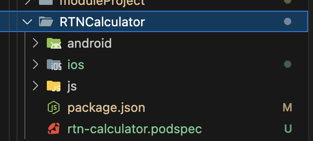
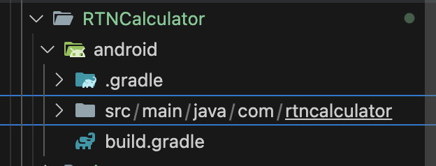
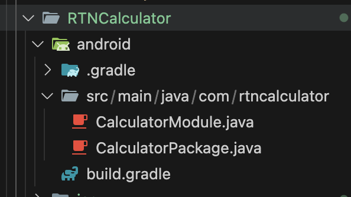

Documentation: https://github.com/reactwg/react-native-new-architecture/blob/main/docs/turbo-modules.md

1. Create RTN[ModuleName] like that:

2. 
<strong>For Android</strong>:
2.a: Create build.gradle sibling src folder 

<code> 
buildscript {
  ext.safeExtGet = {prop, fallback ->
    rootProject.ext.has(prop) ? rootProject.ext.get(prop) : fallback
  }
  repositories {
    google()
    gradlePluginPortal()
  }
  dependencies {
    classpath("com.android.tools.build:gradle:7.3.1")
  }
}

apply plugin: 'com.android.library'
apply plugin: 'com.facebook.react'

android {
  compileSdkVersion safeExtGet('compileSdkVersion', 33)
  namespace "com.rtncalculator"
}

repositories {
  mavenCentral()
  google()
}

dependencies {
  implementation 'com.facebook.react:react-native'
}
</code>
2.b: Go to RTNCalculator/android create src/main/java/com/rtncalculator folder

- CalculatorModule.java
<code> 
package com.rtncalculator;

import androidx.annotation.NonNull;
import com.facebook.react.bridge.NativeModule;
import com.facebook.react.bridge.Promise;
import com.facebook.react.bridge.ReactApplicationContext;
import com.facebook.react.bridge.ReactContext;
import com.facebook.react.bridge.ReactContextBaseJavaModule;
import com.facebook.react.bridge.ReactMethod;
import java.util.Map;
import java.util.HashMap;
import com.rtncalculator.NativeCalculatorSpec;

public class CalculatorModule extends NativeCalculatorSpec {

    public static String NAME = "RTNCalculator";

    CalculatorModule(ReactApplicationContext context) {
        super(context);
    }

    @Override
    @NonNull
    public String getName() {
        return NAME;
    }

    @Override
    public void add(double a, double b, Promise promise) {
        promise.resolve(a + b);
    }
    @Override
    public void sub(double a, double b, Promise promise) {
        promise.resolve(a - b);
    }
}
</code>

- CalculatorPackage.java
<code> 
package com.rtncalculator;

import androidx.annotation.Nullable;
import com.facebook.react.bridge.NativeModule;
import com.facebook.react.bridge.ReactApplicationContext;
import com.facebook.react.module.model.ReactModuleInfoProvider;
import com.facebook.react.TurboReactPackage;
import com.facebook.react.module.model.ReactModuleInfo;
import java.util.Collections;
import java.util.List;
import java.util.HashMap;
import java.util.Map;
public class CalculatorPackage extends TurboReactPackage {

  @Nullable
  @Override
  public NativeModule getModule(String name, ReactApplicationContext reactContext) {
       if (name.equals(CalculatorModule.NAME)) {
          return new CalculatorModule(reactContext);
      } else {
          return null;
      }
  }

  @Override
  public ReactModuleInfoProvider getReactModuleInfoProvider() {
            return () -> {
          final Map<String, ReactModuleInfo> moduleInfos = new HashMap<>();
          moduleInfos.put(
                  CalculatorModule.NAME,
                  new ReactModuleInfo(
                          CalculatorModule.NAME,
                          CalculatorModule.NAME,
                          false, // canOverrideExistingModule
                          false, // needsEagerInit
                          true, // hasConstants
                          false, // isCxxModule
                          true // isTurboModule
          ));
          return moduleInfos;
      };
  }
}
</code>

