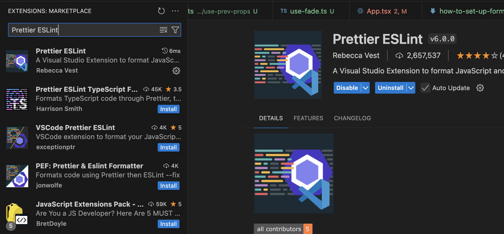

# Getting Start

## 1. Go to extension on VSCode

Search _Prettier_ ESLint and install



## 2. Touch CMD + Shift + P -> Open User Setting (JSON)

```json
{
    // ... More config ...
    
    "editor.fontSize": 14,
    "auto-rename-tag.activationOnLanguage": [
        "javascript",
        "javascriptreact",
        "typescript",
        "typescriptreact"
    ],
    "auto-close-tag.activationOnLanguage": [
        "xml",
        "blade",
        "ejs",
        "javascript",
        "javascriptreact",
        "typescript",
        "typescriptreact",
        "plaintext",
        "markdown"
    ],
    "editor.defaultFormatter": "rvest.vs-code-prettier-eslint",
    "editor.formatOnType": false,
    // "editor.formatOnSave": true, // optional
    // "editor.formatOnSaveMode": "file", // required to format on save
    "vs-code-prettier-eslint.prettierLast": false, // set as "true" to run 'prettier' last not first
    // "[javascript]": {
    //   "editor.defaultFormatter": "esbenp.prettier-vscode"
    // },
    "eslint.validate": ["javascript", "javascriptreact", "typescript", "typescriptreact"],
    "typescript.updateImportsOnFileMove.enabled": "always",
    "javascript.updateImportsOnFileMove.enabled": "always"

     // ... More config ...
}
```

## 2. At .prettierrc.js and add

```js
module.exports = {
    arrowParens: 'avoid',
    bracketSpacing: true,
    jsxBracketSameLine: false,
    jsxSingleQuote: false,
    quoteProps: 'as-needed',
    singleQuote: true,
    semi: true,
    printWidth: 100,
    useTabs: false,
    tabWidth: 4,
    trailingComma: 'es5',
};
```
